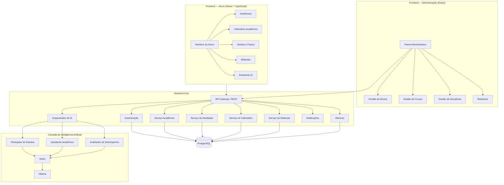

# 📚 Atlas

> Plataforma inteligente para organização, acompanhamento e planejamento da vida acadêmica.

  <strong>📚 Organize. Planeje. Aprenda. Evolua.</strong>

---

## 📌 Sobre

O **Atlas** é uma plataforma de gestão acadêmica baseada em **Inteligência Artificial**, desenvolvida para auxiliar estudantes na organização de sua rotina acadêmica.

A plataforma centraliza informações como disciplinas, provas, trabalhos, atividades, materiais e prazos em um único ambiente.

Além da organização, o Atlas utiliza Inteligência Artificial para analisar as atividades acadêmicas do estudante e fornecer recomendações de estudo, identificação de prioridades e acompanhamento do desempenho.

A proposta é transformar uma rotina acadêmica desorganizada em uma experiência mais **simples, centralizada e inteligente**.

---

## 🎯 Objetivo

O objetivo do Atlas é facilitar a organização da vida acadêmica dos estudantes, reduzindo:

* Esquecimento de prazos;
* Acúmulo de atividades;
* Falta de organização;
* Dificuldade na definição de prioridades;
* Falta de acompanhamento do desempenho;
* Desorganização dos materiais de estudo.

A plataforma busca oferecer ao estudante uma visão clara de suas responsabilidades e ajudá-lo a decidir **o que estudar, quando estudar e quais atividades devem ser priorizadas**.

---

# 🏗️ Arquitetura

A arquitetura do Atlas é dividida em **Frontend, Backend, Inteligência Artificial e Banco de Dados**.

O arquivo-fonte da arquitetura está disponível em:

`arquitetura.puml`

---

# 🛠️ Tecnologias

## Backend

Backend desenvolvido utilizando **Go**, responsável pela API, regras de negócio e integração entre os serviços.

---

## Frontend

Interface desenvolvida utilizando **React + TypeScript**.

---

## Banco de Dados

Responsável pelo armazenamento das informações acadêmicas.

---

## Inteligência Artificial

Utilização de modelos locais através do **Ollama**, com o **Qwen** como modelo de linguagem.

---

## Arquitetura e Versionamento

---

### Comunicação

A comunicação entre frontend e backend será realizada utilizando:

* REST API;
* WebSocket.

---

<strong>📚 Atlas — Organize sua vida acadêmica de forma inteligente.</strong>

  
