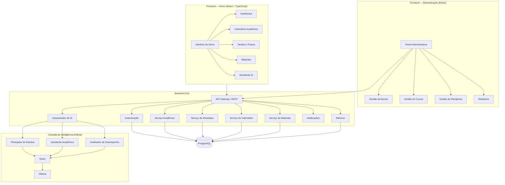

# 📚 Atlas

> Plataforma inteligente para organização, acompanhamento e planejamento da vida acadêmica.

<p align="center">

<a href="#-sobre">

</a>

<a href="#-inteligência-artificial">

</a>

<a href="#-sistema">

</a>

<a href="#-tecnologias">

</a>

</p>

<p align="center">
  <strong>📚 Organize. Planeje. Aprenda. Evolua.</strong>
</p>

---

## 📌 Sobre

O **Atlas** é uma plataforma de gestão acadêmica baseada em **Inteligência Artificial**, desenvolvida para auxiliar estudantes na organização de sua rotina acadêmica.

A plataforma centraliza informações como disciplinas, provas, trabalhos, atividades, materiais e prazos em um único ambiente.

Além da organização, o Atlas utiliza Inteligência Artificial para analisar as atividades acadêmicas do estudante e fornecer recomendações de estudo, identificação de prioridades e acompanhamento do desempenho.

A proposta é transformar uma rotina acadêmica desorganizada em uma experiência mais **simples, centralizada e inteligente**.

---

## 🎯 Objetivo

O objetivo do Atlas é facilitar a organização da vida acadêmica dos estudantes, reduzindo:

* Esquecimento de prazos;
* Acúmulo de atividades;
* Falta de organização;
* Dificuldade na definição de prioridades;
* Falta de acompanhamento do desempenho;
* Desorganização dos materiais de estudo.

A plataforma busca oferecer ao estudante uma visão clara de suas responsabilidades e ajudá-lo a decidir **o que estudar, quando estudar e quais atividades devem ser priorizadas**.

---

## 🚀 Principais funcionalidades

### 📅 Organização acadêmica

* Cadastro de disciplinas;
* Cadastro de provas;
* Cadastro de trabalhos;
* Cadastro de atividades;
* Controle de prazos;
* Calendário acadêmico;
* Organização por semestre.

### 📚 Materiais

* Upload de materiais;
* Organização por disciplina;
* Anotações;
* Links úteis;
* Centralização dos conteúdos.

### 🤖 Inteligência Artificial

* Assistente acadêmico;
* Planejamento de estudos;
* Identificação de prioridades;
* Análise de desempenho;
* Recomendações personalizadas;
* Consulta de atividades por linguagem natural.

### 📊 Dashboard

* Próximas provas;
* Trabalhos pendentes;
* Atividades atrasadas;
* Progresso acadêmico;
* Desempenho por disciplina;
* Resumo da semana.

---

# 🏗️ Arquitetura

A arquitetura do Atlas é dividida em **Frontend, Backend, Inteligência Artificial e Banco de Dados**.



O arquivo-fonte da arquitetura está disponível em:

`arquitetura.puml`

---

# 🧠 Inteligência Artificial

A camada de Inteligência Artificial é responsável por analisar os dados acadêmicos e fornecer recursos inteligentes ao estudante.

## 🤖 Planejador de Estudos

O Planejador de Estudos analisa as atividades cadastradas pelo estudante e considera fatores como:

* Data das provas;
* Prazo dos trabalhos;
* Prioridade;
* Disciplina;
* Tempo disponível;
* Atividades pendentes.

A partir dessas informações, o sistema pode gerar uma sugestão de planejamento.

### Exemplo

> "Você possui uma prova de Banco de Dados em 5 dias e um trabalho de Engenharia de Software para entregar em 3 dias. Recomendo priorizar o trabalho e reservar um período para revisão de Banco de Dados."

---

## 💬 Assistente Acadêmico

O estudante pode interagir com a IA utilizando linguagem natural.

### Exemplos

> "Quais atividades tenho para essa semana?"

> "Qual é minha próxima prova?"

> "O que devo estudar hoje?"

> "Quais trabalhos estão próximos do prazo?"

> "Como está meu desempenho em cada disciplina?"

O assistente consulta as informações disponíveis no sistema e apresenta respostas contextualizadas.

---

## 📊 Analisador de Desempenho

O sistema pode analisar dados acadêmicos para identificar:

* Evolução das notas;
* Disciplinas com maior dificuldade;
* Atividades atrasadas;
* Frequência de atividades;
* Desempenho por período;
* Evolução geral do estudante.

---

# 🖥️ Sistema

## 👨‍🎓 Área do Aluno

A área do aluno é o principal ambiente da plataforma.

### Dashboard

Apresenta um resumo da situação acadêmica:

* 📅 Atividades de hoje;
* 🔴 Atividades urgentes;
* 🟡 Atividades pendentes;
* 📚 Próximas provas;
* 📈 Desempenho;
* 🤖 Recomendações da IA.

---

### 📅 Calendário

Permite visualizar:

* Provas;
* Trabalhos;
* Atividades;
* Aulas;
* Eventos acadêmicos;
* Prazos.

---

### 📝 Tarefas

O estudante pode:

* Criar tarefas;
* Definir prazos;
* Definir prioridades;
* Associar tarefas a disciplinas;
* Alterar o status;
* Marcar como concluída.

---

### 📚 Materiais

Área destinada à organização dos materiais acadêmicos.

Os materiais podem ser separados por:

* Curso;
* Semestre;
* Disciplina;
* Tipo de conteúdo.

---

### 🤖 Assistente IA

Interface de conversa entre o estudante e o assistente acadêmico.

O objetivo é permitir que o estudante consulte suas informações de maneira natural.

---

# 👨‍💼 Painel Administrativo

O painel administrativo permite o gerenciamento da plataforma.

### 👥 Gestão de alunos

* Cadastro;
* Atualização;
* Consulta;
* Situação acadêmica.

### 🎓 Gestão de cursos

* Cadastro de cursos;
* Semestres;
* Turmas;
* Disciplinas.

### 📚 Gestão de disciplinas

* Cadastro;
* Professores;
* Turmas;
* Conteúdos.

### 📊 Relatórios

* Desempenho;
* Atividades;
* Estatísticas;
* Indicadores acadêmicos.

---

# 🛠️ Tecnologias

## Backend


Backend desenvolvido utilizando **Go**, responsável pela API, regras de negócio e integração entre os serviços.

---

## Frontend


Interface desenvolvida utilizando **React + TypeScript**.

---

## Banco de Dados


Responsável pelo armazenamento das informações acadêmicas.

---

## Inteligência Artificial


Utilização de modelos locais através do **Ollama**, com o **Qwen** como modelo de linguagem.

---

## Arquitetura e Versionamento


---

### Comunicação

A comunicação entre frontend e backend será realizada utilizando:

* REST API;
* WebSocket.

---

# 🎨 Protótipo

O protótipo das interfaces está sendo desenvolvido no **Figma**.

<p align="center">

<a href="https://www.figma.com/">

</a>

</p>

> O link será atualizado quando o protótipo estiver disponível.

---

# 📂 Estrutura do projeto

```text
Atlas/
│
├── backend/
│   ├── cmd/
│   ├── internal/
│   │   ├── auth/
│   │   ├── academic/
│   │   ├── tasks/
│   │   ├── calendar/
│   │   ├── materials/
│   │   ├── notifications/
│   │   └── metrics/
│   └── go.mod
│
├── frontend/
│   ├── src/
│   │   ├── components/
│   │   ├── pages/
│   │   ├── services/
│   │   ├── hooks/
│   │   └── types/
│   └── package.json
│
├── ai/
│   ├── prompts/
│   ├── planner/
│   ├── assistant/
│   └── analyzer/
│
├── database/
│   ├── migrations/
│   └── seeds/
│
├── diagramas/
│   └── arquitetura.puml
│
├── docs/
│   ├── requisitos/
│   ├── casos-de-uso/
│   └── prototipos/
│
└── README.md
```

---

# 🔐 Segurança

O Atlas deverá possuir mecanismos para proteção das informações acadêmicas.

Entre eles:

* Autenticação de usuários;
* Controle de acesso;
* Validação de dados;
* Proteção das APIs;
* Gerenciamento de sessões;
* Separação entre usuários e administradores.

---

# 📈 Roadmap

### 🟢 Fase 1 — Planejamento

* [x] Definição da ideia
* [x] Levantamento inicial dos requisitos
* [x] Definição das funcionalidades
* [ ] Documentação dos requisitos

### 🟡 Fase 2 — Arquitetura

* [x] Definição da arquitetura
* [x] Escolha das tecnologias
* [ ] Modelagem do banco
* [ ] Diagramas UML
* [ ] Definição das APIs

### 🟡 Fase 3 — Prototipação

* [ ] Wireframes
* [ ] Protótipo no Figma
* [ ] Validação das interfaces
* [ ] Design final

### ⚪ Fase 4 — Desenvolvimento

* [ ] Backend
* [ ] Frontend
* [ ] Banco de dados
* [ ] Autenticação
* [ ] Sistema de tarefas
* [ ] Calendário
* [ ] Materiais

### ⚪ Fase 5 — Inteligência Artificial

* [ ] Integração com Ollama
* [ ] Integração com Qwen
* [ ] Assistente acadêmico
* [ ] Planejador de estudos
* [ ] Analisador de desempenho

### ⚪ Fase 6 — Finalização

* [ ] Testes
* [ ] Correção de problemas
* [ ] Testes de integração
* [ ] Documentação
* [ ] Apresentação final

---

# 📊 Status

🟡 **Em desenvolvimento**

| Etapa                      | Status          |
| -------------------------- | --------------- |
| 💡 Planejamento            | 🟢 Concluído    |
| 📋 Requisitos              | 🟡 Em andamento |
| 🏗️ Arquitetura            | 🟢 Concluído    |
| 🎨 Prototipação            | 🟡 Em andamento |
| 💻 Backend                 | ⚪ Pendente      |
| 🖥️ Frontend               | ⚪ Pendente      |
| 🗄️ Banco de Dados         | ⚪ Pendente      |
| 🤖 Inteligência Artificial | ⚪ Pendente      |
| 🔐 Segurança               | ⚪ Pendente      |
| 🧪 Testes                  | ⚪ Pendente      |
| 📚 Documentação            | ⚪ Pendente      |

---

# 🎓 Projeto Integrador

O **Atlas** é um projeto acadêmico desenvolvido para a disciplina de **Projeto Integrador**, aplicando conceitos de:

* Engenharia de Software;
* Desenvolvimento Web;
* Desenvolvimento de APIs;
* Banco de Dados;
* Inteligência Artificial;
* Arquitetura de Software;
* Prototipação;
* Versionamento de código;
* Metodologias de desenvolvimento.

---

# 📄 Documentação

A documentação do projeto será organizada em:

* 📋 Requisitos funcionais;
* 📋 Requisitos não funcionais;
* 👤 Casos de uso;
* 🏗️ Arquitetura;
* 🗄️ Modelo de banco de dados;
* 🔌 Documentação da API;
* 🤖 Documentação da IA;
* 🎨 Protótipos;
* 🧪 Testes.

---

# 🌐 Links

<p align="center">

<a href="#">

</a>

<a href="#">

</a>

<a href="#">

</a>

<a href="#">

</a>

</p>

---

<p align="center">

<strong>📚 Atlas — Organize sua vida acadêmica de forma inteligente.</strong>

<br><br>

Desenvolvido com 💻 e 🤖 para o Projeto Integrador.

</p>
