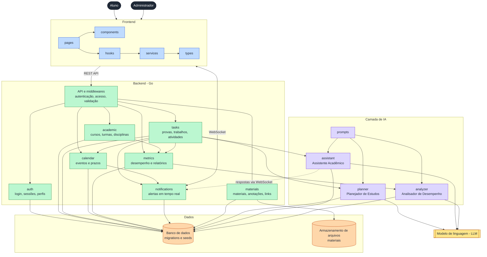
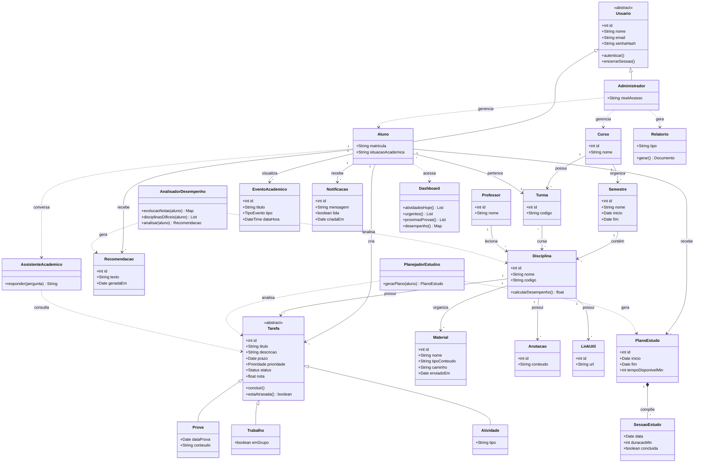

# Arquitetura - Atlas

Este documento descreve a arquitetura geral da plataforma Atlas e o modelo de domínio.

## Visão geral



## Comunicação

A comunicação entre frontend e backend é feita por:

- REST API: operações de cadastro, consulta e atualização;
- WebSocket: notificações e respostas do assistente em tempo real.

## Segurança

- Autenticação de usuários;
- Controle de acesso;
- Validação de dados;
- Proteção das APIs;
- Gerenciamento de sessões;
- Separação entre usuários e administradores.

## Modelo de domínio



## Estrutura do projeto

```
Atlas/
├── backend/
│   ├── cmd/
│   └── internal/
│       ├── auth/
│       ├── academic/
│       ├── tasks/
│       ├── calendar/
│       ├── materials/
│       ├── notifications/
│       └── metrics/
├── frontend/
│   └── src/
│       ├── components/
│       ├── pages/
│       ├── services/
│       ├── hooks/
│       └── types/
├── ai/
│   ├── prompts/
│   ├── planner/
│   ├── assistant/
│   └── analyzer/
├── database/
│   ├── migrations/
│   └── seeds/
├── docs/
│   ├── diagrams/
│   ├── requisitos/
│   ├── casos-de-uso/
│   └── prototipos/
└── README.md
```
