# MVP Roadmap - Atlas

Este documento propõe a ordem de desenvolvimento do Atlas. As fases e prioridades são uma sugestão e podem ser ajustadas conforme o time e o prazo.

## Fases do MVP

```mermaid
flowchart LR
    F1["Fase 1<br/>Fundação<br/>Autenticação<br/>Cadastro de cursos, semestres e disciplinas"]
    F2["Fase 2<br/>Tarefas e Calendário<br/>Provas, trabalhos, atividades<br/>Prazos e prioridades"]
    F3["Fase 3<br/>Materiais<br/>Upload, anotações<br/>Links úteis"]
    F4["Fase 4<br/>Dashboard<br/>Urgentes, pendentes<br/>Próximas provas, desempenho"]
    F5["Fase 5<br/>Inteligência Artificial<br/>Assistente, planejador<br/>Analisador de desempenho"]
    F6["Fase 6<br/>Administração<br/>Gestão de alunos e cursos<br/>Relatórios"]

    F1 --> F2 --> F3 --> F4 --> F5 --> F6

    classDef p1 fill:#BFDBFE,stroke:#1D4ED8,color:#1F2937
    classDef p2 fill:#BBF7D0,stroke:#15803D,color:#1F2937
    classDef p3 fill:#FBCFE8,stroke:#BE185D,color:#1F2937
    classDef p4 fill:#FDE68A,stroke:#B45309,color:#1F2937
    classDef p5 fill:#DDD6FE,stroke:#6D28D9,color:#1F2937
    classDef p6 fill:#FED7AA,stroke:#C2410C,color:#1F2937

    class F1 p1
    class F2 p2
    class F3 p3
    class F4 p4
    class F5 p5
    class F6 p6
```

## Entregas por fase

| Fase | Entregas | Módulos do backend |
|---|---|---|
| 1. Fundação | Login, sessões, perfis de aluno e administrador, cadastro acadêmico | `auth`, `academic` |
| 2. Tarefas e Calendário | Provas, trabalhos, atividades, status, calendário, notificações | `tasks`, `calendar`, `notifications` |
| 3. Materiais | Upload por disciplina, anotações, links úteis | `materials` |
| 4. Dashboard | Resumo do dia e da semana, urgentes, pendentes, desempenho | `metrics` |
| 5. Inteligência Artificial | Assistente, planejador de estudos, analisador de desempenho | `ai/planner`, `ai/assistant`, `ai/analyzer` |
| 6. Administração | Gestão de alunos, cursos e disciplinas, relatórios | `academic`, `metrics` |

## Dependências

- A Fase 2 depende da Fase 1, pois tarefas pertencem a disciplinas.
- A Fase 4 depende da Fase 2, pois o dashboard resume tarefas e provas.
- A Fase 5 depende das Fases 2 e 4, pois a IA lê tarefas, prazos e desempenho.
