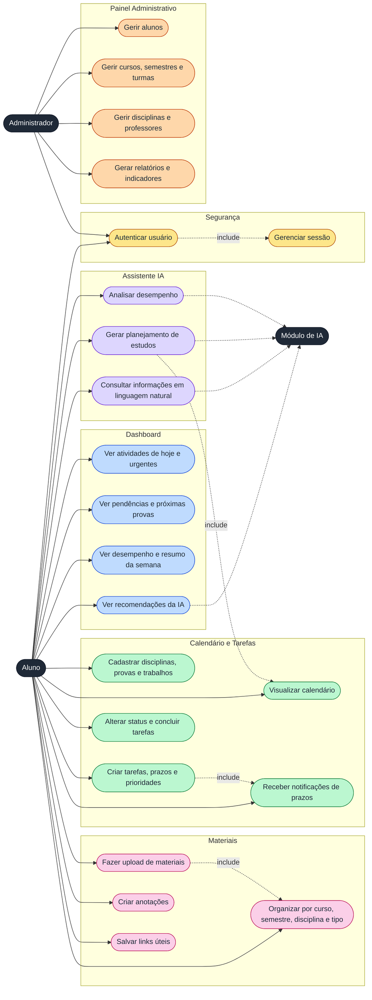

# Casos de Uso - Atlas

Este documento descreve o que cada tipo de usuário pode fazer na plataforma Atlas.

## Atores

| Ator | Descrição |
|---|---|
| Aluno | Organiza a vida acadêmica, consulta materiais e conversa com o assistente de IA |
| Administrador | Gerencia alunos, cursos, disciplinas e acompanha relatórios |
| Módulo de IA | Sistema que planeja estudos, analisa desempenho e responde perguntas |

## Diagrama de casos de uso

## Casos de uso por módulo

### Área do Aluno

| Módulo | Casos de uso |
|---|---|
| Dashboard | Atividades de hoje, urgentes, pendentes, próximas provas, desempenho, recomendações da IA |
| Calendário e Tarefas | Provas, trabalhos, atividades, aulas, eventos, prazos, notificações |
| Materiais | Upload, organização por curso, semestre, disciplina e tipo, anotações, links úteis |
| Assistente IA | Perguntas em linguagem natural, planejamento de estudos, análise de desempenho |

### Painel Administrativo

| Módulo | Casos de uso |
|---|---|
| Gestão de alunos | Cadastro, atualização, consulta, situação acadêmica |
| Gestão de cursos | Cursos, semestres, turmas, disciplinas |
| Gestão de disciplinas | Cadastro, professores, turmas, conteúdos |
| Relatórios | Desempenho, atividades, estatísticas, indicadores acadêmicos |

## Exemplos de interação com o assistente

- "Quais atividades tenho para essa semana?"
- "Qual é minha próxima prova?"
- "O que devo estudar hoje?"
- "Quais trabalhos estão próximos do prazo?"
- "Como está meu desempenho em cada disciplina?"
